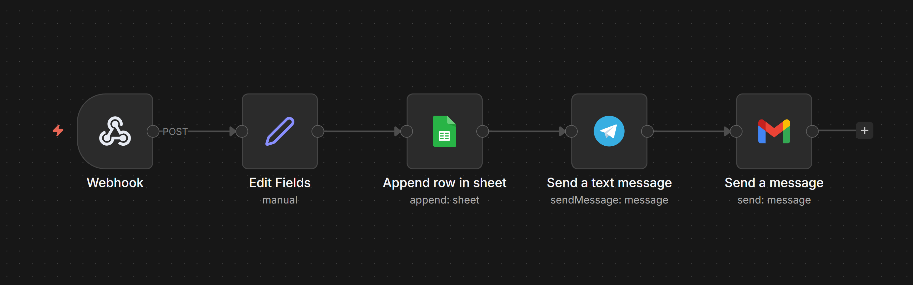

 🛒 E-commerce Order Automation (n8n)

 📌 Description

This project is an automated e-commerce order processing system built with n8n.
It captures incoming orders via webhook, stores them in Google Sheets, and sends real-time notifications via Telegram and email.

 ⚙️ Technologies Used

* n8n (workflow automation)
* Webhook (order input)
* Google Sheets
* Telegram Bot
* Gmail API

 🔄 Workflow Steps

1. Webhook → receives order data
2. Edit Fields → processes and formats order details
3. Append Row → stores order in Google Sheets
4. Send Telegram Message → instant notification
5. Send Email → order confirmation or alert

 📸 Workflow Screenshot

 🛠️ How to Use

1. Import `workflow.json` into n8n
2. Configure webhook endpoint
3. Connect Google Sheets
4. Set up Telegram bot
5. Configure Gmail account
6. Activate the workflow

 🎯 Use Case

Automate order handling for e-commerce systems with real-time tracking and notifications.

 👨‍💻 Author

Ziad El Yazidi
